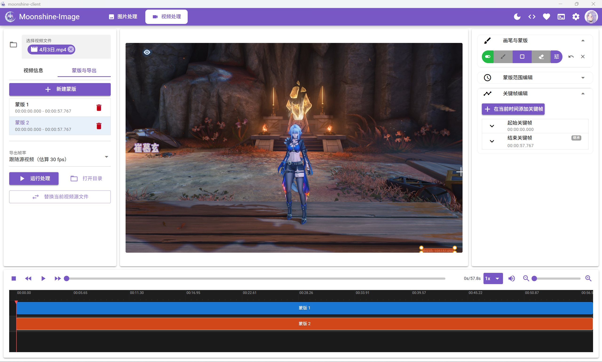
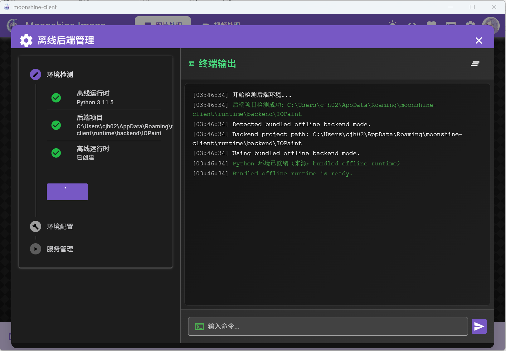

# Moonshine-Image

Moonshine-Image 是一个面向本地图片与视频去除任务的 Windows 桌面工具，支持 [Lama](https://github.com/advimman/lama) 通用擦除、[MAT](https://github.com/fenglinglwb/MAT) 蒙版修复、[SLBR](https://github.com/bcmi/SLBR-Visible-Watermark-Removal) 半透明水印去除、视频帧处理、模型管理、后端诊断和 [FFmpeg](https://ffmpeg.org/) 兜底导出。

项目基于 [Vue 3](https://cn.vuejs.org/)、[Quasar](https://quasar.dev/)、[Electron](https://www.electronjs.org/) 与本地 [Python](https://www.python.org/) 后端构建，最初基于 [IOPaint](https://github.com/Sanster/IOPaint) 二次开发，目前已经迁移为仓库内置的 `moonshine_server` 后端服务。

更多使用到的依赖：Web视频处理能力[WebAV](https://github.com/WebAV-Tech/WebAV)、vue时间轴轨道组件[vue-timeline-editor](https://github.com/CuiMuxuan/vue-timeline-editor)

## 能力边界

水印去除不是原图还原。水印会遮挡或污染原始像素，任何去除水印的模型都做不到完全恢复原图。

如果水印盖住了人物五官、文字、产品细节等关键内容，建议使用即梦、Stable Diffusion、Flux 等生成式 AI 进行重绘。视频水印也可以尝试 [ProPainter](https://github.com/sczhou/ProPainter)，但它对设备性能要求较高，Moonshine-Image 后续不计划集成 ProPainter。

## 功能概览

| 功能 | 状态 | 说明 |
| --- | --- | --- |
| 图片导入与批量处理 | ✅ | 支持单图、选中文件、文件夹模式和大批量路径导入 |
| Lama 通用擦除 | ✅ | 需要手动绘制蒙版，适合物体、文字、不规则遮挡区域 |
| MAT 蒙版修复 | ✅ | 与 Lama 同级的图片/视频蒙版修复模型，需要 CUDA，仅限非商业用途 |
| SLBR 半透明水印去除 | ✅ | 不需要手动蒙版，仅适合可见半透明水印 |
| 图片输出策略 | ✅ | 支持 `auto`、`original`、`png`、`jpg`、`webp` 和 JPG/WebP 质量控制 |
| 视频处理 | ✅ | 支持上传、预览、蒙版、时间轴、关键帧、处理结果替换和撤销 |
| FFmpeg 兜底导出 | ✅ | WebAV 导出失败时可在 `auto` 模式下切换 FFmpeg |
| 模型管理 | ✅ | 支持模型状态、校验、下载源和手动安装说明 |
| 后端管理 | ✅ | 支持环境检测、服务启停、终端日志和处理进度 |
| 视频后台恢复与断点续跑 | ✅ | 失败或中断后可复用已完成分段继续处理，不做多任务队列 |
| OCR 自动生成蒙版 | 📝 | 尚未实现 |
| SAM 智能选区 | 🚧 | 已接入 SAM1/SAM2.1 单图点选/框选、SAM2.1 视频传播后端接口，以及 SAM3/SAM3.1 文本提示词智能选区首版 |

## 界面预览

### 图片处理


### 视频处理



### 模型管理与全局设置


### 后端管理



## 下载选择

> v1.2.0 是最后一个完全离线发布版本：Windows x64 发布包仍按 Torch 运行时和模型策略拆分，运行时、FFmpeg 和 bundled 模型随包提供；后续版本将转向应用本体、运行时和模型资源解耦更新。发布信息和相对 v1.1.0 的主要更新，请查看 GitHub Releases 中的 v1.2.0 Release Notes。

| 包类型 | 适合用户 |
| --- | --- |
| `cu130` | 新 NVIDIA 显卡(特别是**50系**)用户优先选择 |
| `cu126` | 旧 NVIDIA 显卡或 CUDA 13.0 兼容性不稳定时选择 |
| `cpu` | 没有 NVIDIA 显卡或只想验证功能时选择，处理速度会明显更慢 |
| `bundled-models` | 包内包含 Lama 与 SLBR，下载后最快开始使用，体积更大 |
| `external-models` | 包体积更小，需要在软件内下载模型或手动放置模型 |

发布包命名示例：

```text
Moonshine-Image-v1.2.0-win-x64-cu130-bundled-models.zip
Moonshine-Image-v1.2.0-win-x64-cu126-external-models.zip
Moonshine-Image-v1.2.0-win-x64-cpu-external-models.zip
```

下载后可用 Release 附带的 `SHA256SUMS.txt` 校验文件完整性。

链接： [夸克网盘](https://pan.quark.cn/s/01fd386af406?pwd=TqnK) 
[hugging face](https://huggingface.co/buckets/CuiMuxuan/Moonshine-Image-Release)

## 项目使用

### 使用内置双模型包

1. 下载 `bundled-models` 发布包并解压。
2. 打开 `Moonshine-Image.exe`。
3. 导入图片或视频。
4. 选择处理模型。
5. 点击运行，处理完成后打开输出目录或下载结果。

### 使用模型外置包

1. 下载 `external-models` 发布包并解压。
2. 打开 `Moonshine-Image.exe`。
3. 进入“全局设置 > 模型管理”。
4. 下载模型，或按手动安装说明把模型文件放入模型目录。
5. 返回图片或视频页面，选择模型并运行。

发布包内关键路径：

- 后端项目：`resources/backend/server`
- Python 运行时：`resources/runtime/win-x64/env`
- FFmpeg：`resources/ffmpeg/win-x64`
- 模型目录：`resources/models`

## 模型说明

### Lama 去除模型

> Lama 需要手动绘制蒙版，适合通用擦除、图像修复、不规则物体遮挡和不透明区域处理。它会根据蒙版周围内容补全图像，但无法真正恢复被遮挡的原始细节。

### MAT 去除模型

> MAT 与 Lama 同属于需要蒙版的图片/视频修复模型，复用现有图片处理、批量处理和视频逐帧处理流程，不提供专用页面或专用按钮。
>
> MAT 需要 CUDA 才能运行。配置默认模型为 MAT 但当前 CUDA 不可用时，应用会自动切换回 LaMa，并提示：`MAT 需要 CUDA，当前已自动切换为 LaMa。`
>
> MAT 权重按 CC BY-NC 4.0 处理，仅限非商业用途；使用、分发或镜像下载时必须保留上游来源、署名和许可证说明。推荐安装路径：`models/mat/Places_512_FullData_G.pth`。

### SLBR 透明水印去除模型

> SLBR 不需要手动蒙版，仅对可见半透明水印有效，适合批量清理半透明文字或图案水印。
>
> SLBR 对不透明水印效果极差，不应作为不透明水印去除方案使用。如果水印是不透明贴片、粗黑字、遮挡关键细节的 logo 或大面积覆盖内容，请优先使用 Lama 手动蒙版或生成式 AI 重绘。
>
>> 设备性能会影响此模型的处理效果

### SAM 智能选区模型

> SAM 当前作为蒙版编辑辅助能力接入，不作为 LaMa/SLBR 这类最终图片处理模型。当前支持 SAM1 和 SAM2.1 单图点选/框选生成候选蒙版，生成结果会添加到当前图片蒙版中，再继续供 LaMa 等模型处理。
>
> SAM3/SAM3.1 文本智能选区已作为 CUDA 高配能力接入首版，默认文本模型为 `sam3_1_multiplex`。SAM1/SAM2.1 点选/框选不直接支持自然语言文本选区。
>
> SAM 模型和 LaMa、SLBR 共用同一个模型管理页，但按版本和能力分组。推荐目录结构如下：
>
> - SAM1：`models/sam/sam_vit_b_01ec64.pth`、`models/sam/sam_vit_l_0b3195.pth`、`models/sam/sam_vit_h_4b8939.pth`
> - SAM2.1：`models/sam2/sam2.1_hiera_tiny.pt`、`models/sam2/sam2.1_hiera_small.pt`、`models/sam2/sam2.1_hiera_base_plus.pt`、`models/sam2/sam2.1_hiera_large.pt`
> - SAM3/SAM3.1：`models/sam3/sam3.pt`、`models/sam3/sam3.1_multiplex.pt`
>
> 根目录下的 `models/sam_vit_b_01ec64.pth` 与 `models/sam2.1_hiera_large.pt` 不再作为 SAM 模型安装位置识别。旧文件需要移动到对应子目录后，模型管理页才会显示为已安装。
>
> Windows PowerShell 迁移命令：
>
> ```powershell
> New-Item -ItemType Directory -Force models\sam, models\sam2
> Move-Item -LiteralPath models\sam_vit_b_01ec64.pth -Destination models\sam\sam_vit_b_01ec64.pth
> Move-Item -LiteralPath models\sam2.1_hiera_large.pt -Destination models\sam2\sam2.1_hiera_large.pt
> ```

## 常见问题

### 我应该下载哪个包？

> 有较新的 NVIDIA 显卡，优先选择 `cu130-bundled-models`。旧显卡或 CUDA 13.0 不稳定时选择 `cu126-bundled-models`。没有 NVIDIA 显卡选择 `cpu-bundled-models` 或 `cpu-external-models`。

### 没有 NVIDIA 显卡可以使用吗？

> 可以使用 CPU 包。CPU 包能完成流程验证和少量图片处理，但速度明显慢于 CUDA 包。

### 模型缺失怎么办？

> 进入“全局设置 > 模型管理”，查看模型状态、下载源和手动安装说明。模型外置包首次启动时模型缺失是正常情况。

### 后端启动失败怎么办？

> 打开“后端管理”，检查 Python 运行时、后端项目路径、模型目录和终端日志。路径中包含中文时可能导致 Python 或模型加载异常，建议把软件解压到纯英文路径。

> 模型外置包首次启动时没有模型也应能启动后端服务，并进入模型管理下载或手动安装模型；模型只在实际处理图片或视频时才要求存在。

### FFmpeg 检测失败怎么办？

> v1.2.0 作为最后一个完全离线发布版本会内置 FFmpeg。若检测失败，请确认 `resources/ffmpeg/win-x64` 中存在 `ffmpeg.exe` 与 `ffprobe.exe`，若不存在重新解压发布包检查。

### 为什么水印去除后不能完全恢复原图？

> 水印覆盖位置的**原始像素已经不可见**。去除模型只能根据周围内容推断和补全，不能知道原图真实内容。关键细节被遮挡时，生成式 AI 重绘通常比传统去水印模型更合适。

## 本地开发

### 安装依赖

```bash
npm install
```

### 启动开发模式

```bash
npm run dev
```

如需完整 Electron 能力：

```bash
npm run dev -- -m electron
```

### 构建

```bash
npm run build
```

Windows Electron 构建：

```bash
npm run build -- -m electron
```

Windows 发布矩阵：

```bash
npm run package:win:matrix
```

#### SAM 运行时与模型权重

- `cu126` 与 `cu130` 包内置 SAM3/SAM3.1 的 Python 运行时代码和所需依赖；解压后不依赖用户电脑已有的 Python、Conda 或构建机上的 SAM3 源码目录。
- `cpu` 包保留内置的 SAM1/SAM2/SAM2.1 后端代码，但 SAM3/SAM3.1 属于 CUDA 专属能力，会在模型管理和诊断中明确显示为不可用。
- “运行时自包含”不代表“模型权重内置”。`external-models` 不携带 SAM 权重，`bundled-models` 默认也只携带 LaMa 和 SLBR；SAM 权重仍需通过模型管理下载或手动放入 `models/sam/`、`models/sam2/`、`models/sam3/`。
- 每个矩阵工件都会写入 `release-matrix.json` 的 SAM 运行时能力、模型权重策略和目录/ZIP 审计结果；CUDA 工件还会在干净临时位置验证包内 Python 的 SAM3 导入与图片、视频 smoke。

#### SAM3 开发与构建输入

- Moonshine 仓库维护的是 SAM3 的集成、模型注册、API、诊断和发布审计；上游 `sam3` 源码不是 `server/` 的一部分。CUDA 发布构建会从受控源码构建 wheel，并以非 editable 方式安装进包内 Python 运行时。
- 开发或构建 CUDA 包时，准备一个带有效 `pyproject.toml` 的官方 SAM3 源码目录，并通过 `MOONSHINE_SAM3_SOURCE_DIR` 指定。未设置时，构建脚本默认查找项目同级的 `C:\code\sam3`。

```powershell
$env:MOONSHINE_SAM3_SOURCE_DIR = 'C:\code\sam3'
npm run build -- -m electron
```

- 上述 Electron 命令构建当前默认 Electron 工件；需要生成 CPU、CUDA 12.6、CUDA 13.0 与两种模型包的全部发布组合时，运行发布矩阵。CUDA 12.6 如未使用默认 wheel 路径，可额外设置 `MOONSHINE_TORCH_WHEEL`。

```powershell
$env:MOONSHINE_SAM3_SOURCE_DIR = 'C:\code\sam3'
$env:MOONSHINE_TORCH_WHEEL = 'C:\code\torch\torch-2.11.0+cu126-cp312-cp312-win_amd64.whl'
npm run package:win:matrix
```

- 需要修改上游 SAM3 本身时，应在受控源码仓库中修改并固定其版本，再重新构建运行时；不要把上游源码直接复制到 `server/`。项目内的环境适配应继续放在 Moonshine 的集成层中。

发布矩阵会生成 `cu130`、`cu126`、`cpu` 与 `bundled-models`、`external-models` 的 6 个 Windows x64 包，并在发布目录写入 `SHA256SUMS.txt` 和 `release-matrix.json`。`cpu` 包会把 SAM3/SAM3.1 文本智能选区显示为不可用；`external-models` 包首次启动时允许进入模型管理下载或手动安装模型；`bundled-models` 默认只打包 LaMa 和 SLBR，不默认打包 SAM3 权重。

> **更新（当前发布策略）**：`npm run package:win:matrix` 默认只生成 CPU 与 `cu130` 的四个 Windows x64 工件。当前 `torch 2.11.0+cu130` wheel 分别携带 `sm_75`、`sm_80`、`sm_86`、`sm_90`、`sm_100`、`sm_120` 内核，因此可覆盖这些架构，但这不是 `sm_120` 对 `sm_90` SASS 的向下兼容。低于 `sm_75` 的 GPU 或无法使用 CUDA 13.0 的 NVIDIA 驱动应使用 CPU 包；`cu126` 仅保留为开发者显式构建选项，不再作为正式矩阵发布工件。


### 手动启动后端

后端源码位于 `server/`，Python 包名为 `moonshine_server`。

1. 推荐 Python 3.12.x。
2. 安装依赖：

```bash
pip install -r server/requirements.txt
```

如需 CUDA，请按显卡与 CUDA 版本安装匹配的 PyTorch。

3. 准备模型文件。默认模型目录为项目根目录下的 `models/`：

- Lama：`models/big-lama.pt`
- MAT：`models/mat/Places_512_FullData_G.pth`
- SLBR：`models/slbr.pth.tar`
- SAM1 默认：`models/sam/sam_vit_b_01ec64.pth`
- SAM2.1 默认：`models/sam2/sam2.1_hiera_large.pt`
- SAM3.1 默认：`models/sam3/sam3.1_multiplex.pt`

4. 启动服务：

```bash
python server/main.py start --model=lama --device=cuda --port=8080 --model-dir=models
```

## 回归验证

常用质量闸门：

```bash
npm run lint
npm run build
npm run test:regression:p0
npm run test:regression:p0:assertions
npm run test:regression:release-runtime
npm run test:regression:p1:image
npm run test:regression:p1:video
npm run test:regression:e2e:smoke
npm run test:regression:e2e:workflow
python -m compileall server
```

如果已经完成构建，可复用构建产物运行 E2E：

```powershell
$env:MOONSHINE_E2E_SKIP_BUILD='1'; npm run test:regression:e2e:workflow
```

## Windows SAM3 运行时

- CUDA 发布构建默认从仓库内的 `third_party/sam3` 构建受控 SAM3 wheel，并以非 editable 方式安装进发布包的 Conda 运行时；终端用户不需要 Python、Conda、`C:\code\sam3` 或单独的 SAM3 安装。
- `MOONSHINE_SAM3_SOURCE_DIR` 仅保留给开发者测试其他受控源码树。正式发布默认使用仓库内 vendored 源码及其 `UPSTREAM.md` 中记录的上游版本和 `SAM License`。
- Triton 是可选加速器：可用时继续使用官方 CUDA 内核；Windows 环境不可用时，SAM3 自动使用 SciPy/PyTorch 的兼容后端完成 EDT、NMS 和连通域处理。兼容后端会降低部分后处理性能，但不会把 SAM3 图片、文本或视频能力标记为缺失。
- `external-models` 仍然只表示模型权重外置。CUDA 发布包包含 SAM3 运行时代码和依赖，但首次使用前仍需通过模型管理安装或手动提供 SAM3 权重。

## 许可证与来源

本项目采用 [GNU General Public License v3.0](https://www.gnu.org/licenses/gpl-3.0.html) 许可证开源。

模型文件来自各自公开来源或项目维护者整理的下载源。请在**合法、合规、获得授权**的前提下使用本项目处理图片和视频内容。

MAT 按 [CC BY-NC 4.0](https://creativecommons.org/licenses/by-nc/4.0/) 记录，仅限非商业用途，来源为 [MAT 官方仓库](https://github.com/fenglinglwb/MAT)。SAM1 与 SAM2.1 按各自上游 Apache-2.0 许可证记录。SAM3/SAM3.1 按 Meta `SAM License` 记录，本项目提供下载时仍需保留来源、版本、hash 和许可证说明；CPU 发布包不承诺 SAM3 文本智能选区可用。
