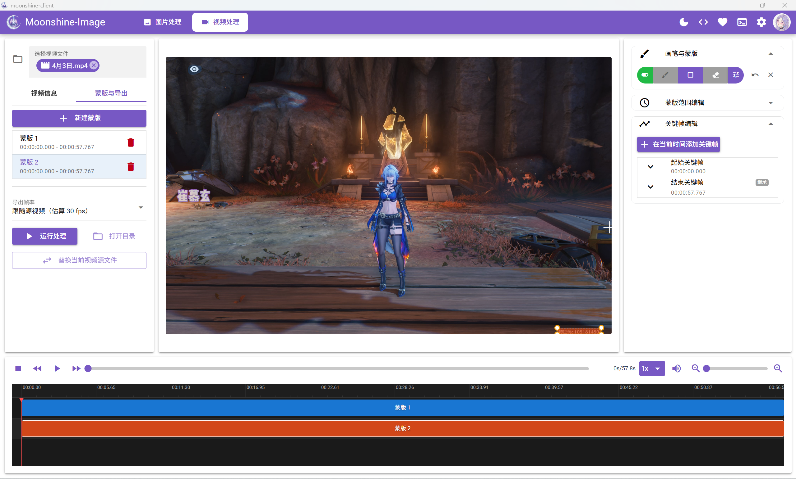
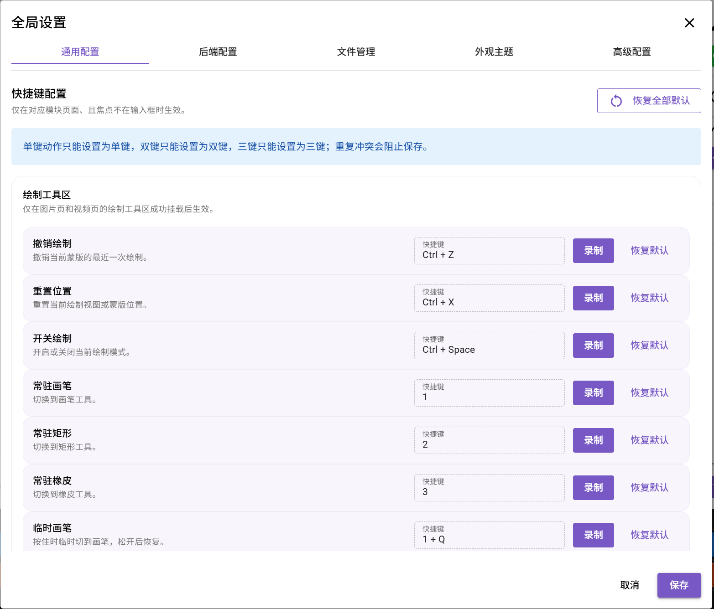
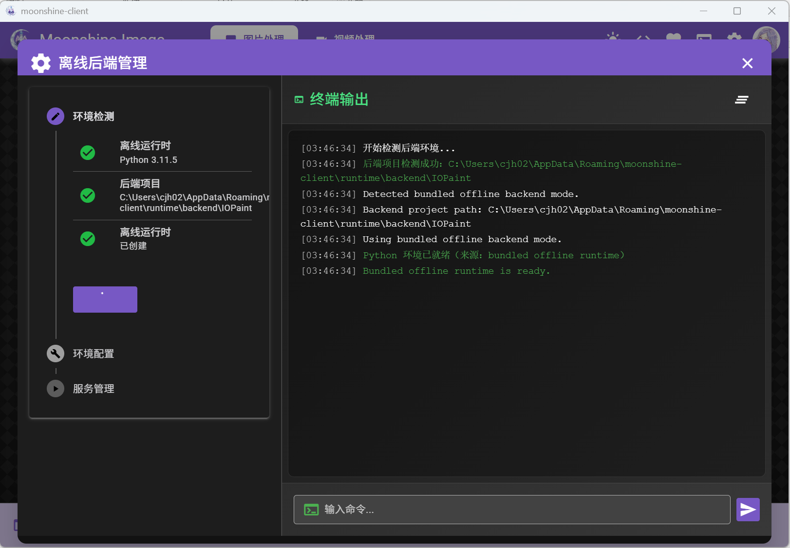

# Moonshine-Image

[访问 Moonshine-Image 官方网站](https://cuimuxuan.github.io/Moonshine-Image/) · [下载最新版本](https://cuimuxuan.github.io/Moonshine-Image/#download)

Moonshine-Image 是一个面向 Windows 的本地图片与视频处理工具，提供水印去除、蒙版修复、智能选区、OCR 自动生成候选蒙版、视频逐帧处理、模型管理、后端诊断以及 MCP 外部调用能力。

当前应用版本：`1.3.4`（Windows x64）。

项目主要由以下组件组成：

- [Vue 3](https://cn.vuejs.org/)、[Quasar](https://quasar.dev/)、[Electron](https://www.electronjs.org/)：桌面界面和应用生命周期。
- 仓库内置的 [`moonshine_server`](server/moonshine_server)：基于 [FastAPI](https://fastapi.tiangolo.com/) 与 [Python](https://www.python.org/) 的本地后端。
- [WebAV](https://github.com/WebAV-Tech/WebAV) 与 [FFmpeg](https://ffmpeg.org/)：视频预览、导出和失败兜底。
- [SQLite](https://www.sqlite.org/) JobStore：任务状态、事件、取消、恢复和结果引用的持久化。
- [Model Context Protocol（MCP）](https://modelcontextprotocol.io/) stdio adapter/native broker：供兼容 MCP 的 AI harness 调用本地服务。

## 使用需知

水印去除不是原图恢复。水印覆盖的原始像素已经不可见，模型只能根据周围内容推断和补全，不能保证还原真实像素。人物五官、文字、产品细节等关键区域被遮挡时，应考虑使用生成式 AI 重绘。

模型、视频编码和显卡驱动的实际效果取决于输入内容、显存、驱动版本和模型权重。SAM2/SAM3 系列属于设备要求较高的智能选区能力；CPU 包不会提供 SAM3/SAM3.1 文本智能选区。

## 功能概览

| 功能 | 状态 | 说明 |
| --- | --- | --- |
| 图片导入与批量处理 | ✅ | 支持单图、选中文件、文件夹和批量任务 |
| LaMa 通用擦除 | ✅ | 手动绘制蒙版，适合物体、文字和不规则遮挡 |
| MAT 蒙版修复 | ✅ | 图片/视频蒙版修复，要求 CUDA；权重按 CC BY-NC 4.0 使用 |
| SLBR 半透明水印去除 | ✅ | 不需要手动蒙版，适合可见半透明水印 |
| 图片输出策略 | ✅ | `auto`、`original`、`png`、`jpg`、`webp` 以及质量控制 |
| 视频处理 | ✅ | 上传、预览、蒙版、时间轴、关键帧、逐帧处理和结果替换 |
| FFmpeg 兜底导出 | ✅ | WebAV 导出失败时，在 `auto` 模式下切换 FFmpeg |
| 模型管理 | ✅ | 状态、校验、下载、手动安装说明和缺失提示 |
| RapidOCR | ✅ | det/rec/cls 三个 ONNX 文件，已接入统一模型流程 |
| SAM 智能选区 | ✅ | SAM1、SAM2.1、标准 SAM3 及 SAM3.1 Multiplex 按能力开放 |
| 后端管理 | ✅ | 环境检测、服务启停、终端日志、健康检查和处理进度 |
| 视频后台恢复 | ✅ | 中断或失败后复用已完成分段继续处理；不提供多任务队列 |
| MCP 外部调用 | ✅ | stdio 配置、权限策略、活动日志、任务和产物回传 |


## 界面预览

### 图片处理


### 视频处理



### 模型管理与全局设置



### 后端管理



## 下载选择

> v1.2.0 是最后一个完全离线发布版本：Windows x64 发布包仍按 Torch 运行时和模型策略拆分，运行时、FFmpeg 和 bundled 模型随包提供；后续版本将转向应用本体、运行时和模型资源解耦更新。发布信息和相对 v1.1.0 的主要更新，请查看 GitHub Releases 中的 v1.2.0 Release Notes。

| 包类型 | 适合用户 |
| --- | --- |
| `cu130` | 新 NVIDIA 显卡(特别是**50系**)用户优先选择 |
| `cu126` | 旧 NVIDIA 显卡或 CUDA 13.0 兼容性不稳定时选择 |
| `cpu` | 没有 NVIDIA 显卡或只想验证功能时选择，处理速度会明显更慢 |
| `bundled-models` | 包内包含 Lama 与 SLBR，下载后最快开始使用，体积更大 |
| `external-models` | 包体积更小，需要在软件内下载模型或手动放置模型 |

发布包命名示例：

```text
Moonshine-Image-v1.2.0-win-x64-cu130-bundled-models.zip
Moonshine-Image-v1.2.0-win-x64-cu126-external-models.zip
Moonshine-Image-v1.2.0-win-x64-cpu-external-models.zip
```

下载后可用 Release 附带的 `SHA256SUMS.txt` 校验文件完整性。

链接： [夸克网盘（副源，文件的完整性受限于作者的网盘会员时限）](https://pan.quark.cn/s/01fd386af406?pwd=TqnK)
[hugging face（主源）](https://huggingface.co/buckets/CuiMuxuan/Moonshine-Image-Release)

## 项目使用

### 使用安装器（安装版）

安装版文件名为 `Moonshine-Image-Setup-版本号.exe`。同目录中的 `.blockmap`、`latest.yml` 和 `app-manifest.json` 是更新及完整性校验元数据。

1. 从项目发布源下载安装器。当前安装器尚未进行 Windows 代码签名；如果 Microsoft Defender SmartScreen 显示“未知发布者”，请先核对下载来源、版本号以及发布材料中的 SHA-256 或签名 manifest，确认无误后再继续。
2. 关闭正在运行的 Moonshine-Image，然后双击 `Moonshine-Image-Setup-版本号.exe`。安装向导允许选择安装目录，按向导完成安装即可。
3. 安装完成后启动 Moonshine-Image。首次启动会先校验应用内置资源；未准备运行环境时，界面会显示“配置本地运行环境”，点击“引导配置”进入“服务管理”。
4. 在“本地运行环境”中保留“自动管理”，加速器可选择 `auto`、`cpu` 或 `cu130`。不确定时使用 `auto`，应用会根据 NVIDIA 显卡和驱动检测结果选择 CUDA 13.0 或 CPU 环境。
5. 点击“创建或修复环境”。普通安装器会准备 Python `3.12.10`，分别检测普通 Python 依赖源与 PyTorch 专用源，并安装匹配的锁定依赖；CUDA 环境还会安装随包提供并经过哈希校验的本地 SAM3 wheel。此过程耗时取决于网络和设备性能。
6. 环境状态变为“已就绪”后，如果界面提示重启应用，请先完成重启；随后点击“启动服务”，等待终端日志显示 `服务健康检查已通过，可以开始使用。`。
7. 进入“全局设置 > 模型管理”，为要使用的功能执行“下载”和“校验”，也可以按照“手动安装说明”放置模型。功能首次调用时可能自动尝试下载缺失模型，但为避免处理中途受网络影响，建议先在模型管理中完成准备。
8. 返回图片处理或视频处理页面，导入文件、创建或选择蒙版、选择处理模型并运行。结果会导出到文件管理中配置的输出目录，不会覆盖原文件。

若使用完整离线包，请先将整个 ZIP 解压到本地目录，并保持安装器与同级 `offline-payload/` 目录的相对位置不变，再从解压目录运行安装器；不要直接在压缩包中运行，也不要只移动安装器。应用会在创建环境时校验并导入离线 runtime 和随附模型。环境准备完成后可以移除解压目录，但保留原 ZIP 便于后续修复或重装。

单独下载的安装器属于 app-only 安装包，内置应用、后端、FFmpeg 及完整性资源，但不会把完整 Python/PyTorch 运行环境和所有模型权重写入安装目录；首次环境准备需要可用网络。安装目录与受管运行环境、模型目录、配置和输出目录相互独立，升级应用不会覆盖这些用户数据。

卸载（请按照Windows应用卸载标准流程进行卸载）时，“删除 Moonshine-Image 配置和保存的设置”与“删除受管运行环境和运行时缓存”默认均不勾选；模型、日志、下载、临时文件、处理结果和外部 Python 环境会继续保留。只有确认不再需要相应数据时，才选择额外清理项。

### 使用内置双模型包（免安装版）

1. 下载 `bundled-models` 发布包并解压。
2. 打开 `Moonshine-Image.exe`。
3. 导入图片或视频。
4. 选择处理模型。
5. 点击运行，处理完成后打开输出目录或下载结果。

### 使用模型外置包（免安装版）

1. 下载 `external-models` 发布包并解压。
2. 打开 `Moonshine-Image.exe`。
3. 进入“全局设置 > 模型管理”。
4. 下载模型，或按手动安装说明把模型文件放入模型目录。
5. 返回图片或视频页面，选择模型并运行。

发布包内关键路径：

- 后端项目：`resources/backend/server`
- Python 运行时：`resources/runtime/win-x64/env`
- FFmpeg：`resources/ffmpeg/win-x64`
- 模型目录：`resources/models`

## 下载与安装

### Windows x64 工件

正式发布目录中的应用工件包括：

```text
Moonshine-Image-Setup-版本号.exe
Moonshine-Image-Setup-版本号.exe.blockmap
Moonshine-Image-Portable-版本号-win-x64.zip
latest.yml
app-manifest.json
```

安装版由 `latest.yml` 和签名的 app manifest 驱动更新。安装版和免安装版都使用同一套应用代码、运行时探测和模型管理流程。

### 首次启动流程

1. 启动应用并进入“环境配置/服务管理”页面。
2. 应用自动识别用户设备 CPU/NVIDIA ，检查可复用的本地环境或随包离线 payload。
2.1 若需要创建环境（常为第一次启动），应用自动准备 Python `3.12.10`，并分别探测普通 Python 依赖源和 PyTorch 专用源。两类源独立测速、校验和选择目标包。
2.2 若应用无法自动配置环境，需手动配置环境，并在“已有环境”中选中配置好的环境。
3. 完成依赖安装后应用自动执行 Python、CUDA、后端和模型路径检查
4. 手动点击“启动服务”，应用自动进行健康检查。
5. 服务启动后，功能已完整，此时需要处理模型。
6. 首次使用缺失模型时，进入“全局设置 > 模型管理”下载、校验或按“手动安装说明”放置文件。若使用功能的模型没有被下载，在初次使用时，应用会自动尝试下载。此步骤偏慢，并且可能会因为网络问题出错，建议提前手动在模型管理页面点击下载。

## 运行环境与依赖源

### 正式运行时矩阵

| 运行时 | 适用场景 | 说明 |
| --- | --- | --- |
| `cpu` | 无 NVIDIA GPU、驱动不兼容或功能验证 | 不提供 SAM3/SAM3.1 文本智能选区；其他能力按模型和设备状态判断 |
| `cu130` | 支持 CUDA 13.0 的 NVIDIA GPU | 正式 CUDA 运行时；默认发布矩阵包含此变体 |

当前 `npm run package:win:matrix` 的默认正式矩阵是 `cpu` 与 `cu130`，默认模型策略是 `bundled-models`。

### 依赖锁定和 SAM3 wheel

CPU 与 CUDA 使用独立锁文件：

```text
server/requirements-cpu.lock.txt
server/requirements-cu130.lock.txt
```

CUDA 锁文件固定 `torch==2.11.0+cu130`、`torchvision==0.26.0+cu130`，并继续固定 `rembg[cpu]==2.0.75` 与 `numpy==2.4.4`。

为避免 PyPI 上的 `sam3` 与 NumPy/其他依赖发生解析冲突，CUDA 锁文件不再安装 PyPI `sam3`。构建和资源准备阶段会：

1. 从受控的 `third_party/sam3` 源码构建 wheel，或使用 `MOONSHINE_SAM3_WHEEL` 指定的预构建 wheel。
2. 将 wheel 放入发布资源的 `resources/sam3`，记录文件名和 SHA-256。
3. 安装基础锁定依赖后，使用 `pip install --no-deps --force-reinstall <sam3-wheel>` 安装该本地 wheel。
4. 在发布审计中验证 SAM3 导入、兼容后端和图片/视频 smoke。

CPU 包跳过 SAM3 wheel。CUDA 包在 Triton 不可用的 Windows 环境中使用项目提供的 SciPy/PyTorch 兼容后端完成 EDT、NMS 和连通域处理。

### 源选择策略

普通 Python 依赖和 PyTorch wheel 使用两套独立的候选源，并分别选出可用且延迟最低的源。

普通 PyPI 候选源：

```text
https://pypi.tuna.tsinghua.edu.cn/simple
https://mirrors.aliyun.com/pypi/simple
https://pypi.org/simple
```

PyTorch CPU/CUDA 候选源：

```text
https://mirrors.tuna.tsinghua.edu.cn/anaconda/cloud/pytorch/
https://mirrors.aliyun.com/pytorch-wheels
https://mirror.sjtu.edu.cn/pytorch-wheels
https://mirrors.nju.edu.cn/pytorch/whl
https://download.pytorch.org/whl/cpu       # CPU
https://download.pytorch.org/whl/cu130     # CUDA 13.0
```

PyTorch 源不仅检查 HTTP 可达性，还检查目标 `torch`/`torchvision` 版本、CUDA 变体和 pip wheel 格式。清华 Anaconda 路径如果可访问但不包含兼容 pip wheel，会被标记为不可用而不是误选。

如果普通 PyPI 源全部不可用，错误会列出该类别检测到的每个源及“不可达/未找到目标依赖”等原因；PyTorch 源全部不可用时同样单独列出该类别的全部原因。两类源的失败信息不会互相覆盖。

## 模型管理

所有模型都在“全局设置 > 模型管理”中统一管理。每个模型可以查看安装状态、文件大小和哈希，执行“校验”“下载”或打开“手动安装说明”。

### 默认模型目录

默认模型根目录由应用配置决定；发布包内通常使用 `resources/models`，手动启动后端时可以使用项目根目录下的 `models/`。推荐目录结构如下：

```text
models/
├─ big-lama.pt
├─ mat/Places_512_FullData_G.pth
├─ slbr.pth.tar
├─ sam/
│  ├─ sam_vit_b_01ec64.pth
│  ├─ sam_vit_l_0b3195.pth
│  └─ sam_vit_h_4b8939.pth
├─ sam2/
│  ├─ sam2.1_hiera_tiny.pt
│  ├─ sam2.1_hiera_small.pt
│  ├─ sam2.1_hiera_base_plus.pt
│  └─ sam2.1_hiera_large.pt
├─ sam3/
│  ├─ sam3.pt
│  └─ sam3.1_multiplex.pt
└─ ocr/
   ├─ PP-OCRv6_det_small.onnx
   ├─ PP-OCRv6_rec_small.onnx
   ├─ ch_ppocr_mobile_v2.0_cls_mobile.onnx
   └─ manifest.json
```

### RapidOCR

RapidOCR 由三个独立的 ONNX 文件组成：检测模型 `det`、识别模型 `rec` 和方向分类模型 `cls`。三个文件分别记录大小、SHA-256、下载进度和来源，缺少任一文件都会在模型状态中明确显示。

主下载源为项目维护的 Hugging Face 仓库：

```text
https://huggingface.co/CuiMuxuan/moonshine-models/resolve/main/ocr/rapidocr
```

副源和手动安装入口为夸克网盘。下载失败时可以从“手动安装说明”打开完整文件清单，将三个文件放入当前模型路径的 `ocr/` 子目录，再执行校验。

### SAM 能力

| 模型 | 图片点选 | 图片框选 | 点框混合 | 图片文本选取 | 视频能力 |
| --- | --- | --- | --- | --- | --- |
| SAM1 | 支持 | 支持 | 按 SAM1 接口 | 不支持 | 不作为视频传播模型 |
| SAM2.1 | 支持 | 支持 | 支持 | 不支持 | 支持视频帧传播 |
| 标准 SAM3 (`sam3.pt`) | 支持 | 支持 | 支持 | 支持中英文文本 | 当前开放图片智能选区 |
| SAM3.1 Multiplex (`sam3.1_multiplex.pt`) | 不开放 | 不开放 | 不开放 | 支持中英文文本 | 支持文本提示的视频传播 |

标准 SAM3 的图片模型支持点选、框选、点框混合和文字提示；同一张图片可以通过批量接口生成多个候选蒙版。SAM3.1 Multiplex 当前缺少图片 instance interactivity 权重，因此图片侧只开放文本选取；需要点选或框选时应切换到标准 SAM3、SAM2.1 或 SAM1。

默认图片智能选区仍使用 SAM1，默认视频智能选区使用 SAM2.1 Hiera Large；SAM3.1 Multiplex 是 SAM3 文本智能选区的默认评估型号。

SAM3/SAM3.1 权重需要遵守 Meta SAM License 及模型清单中的来源、版本和 hash 记录。发布包不默认内置 SAM3 权重，首次使用前请通过模型管理下载或手动放置。

## MCP 外部调用

MCP 服务位于“全局设置 > MCP 服务”。主进程负责 adapter 生命周期、身份认证和 IPC；页面负责保存安全策略。外部客户端通过 MCP stdio 配置接入。

### 工具和权限

工具权限从共享工具定义自动判定。新建配置默认启用只读工具：

```text
moonshine.status
moonshine.capabilities
moonshine.models.list
moonshine.jobs.get
moonshine.jobs.result
moonshine.job_groups.get
```

OCR、蒙版生成、图片处理、批量处理、取消任务等属于任务类工具，需要用户明确加入允许工具列表。

### 目录权限

默认受信任目录是“下载路径 + 图片输出文件夹名”的拼接结果。用户在“全局设置 > 文件管理”中修改下载路径或图片输出文件夹名时，MCP 管理的目录权限同步迁移；用户额外添加的目录继续保留。应用只接受经过规范化、真实路径校验且非符号链接/设备/UNC 路径的目录，最多保留 16 个允许目录。

### 确认模式和客户端操作

MCP 支持 `read_only`、`auto_approve` 和 `full_access` 三种确认模式。启用服务前至少要有一个允许工具和一个允许目录。配置中拒绝 token、authorization、secret、API key、密码等敏感字段。

客户端配置区域提供以下操作：

- 复制 MCP stdio 配置。
- 复制启动命令。
- 检查外部代理连通性。
- 复制 AI 提示词。

“复制 AI 提示词”会把当前生成的配置和启动命令写入提示词，并要求 AI harness（codes、claude code、pi、workbuddy等） 找到自身 MCP 配置位置、写入配置、重新加载连接、执行 `initialize`、工具列表发现和状态检查，然后报告结果。活动日志页可以查看连接、审批、任务和产物事件。

## 本地开发

### 环境要求

- Windows x64 发布构建。
- Node.js 20 或更高版本用于发布工具；开发时建议使用仓库锁定的 npm 依赖。
- Python/Conda 仅在手动后端开发或构建运行时时需要；终端用户不需要预装 Python。
- CUDA 构建需要匹配的 NVIDIA 驱动和目标 PyTorch wheel。

### 安装和启动

```bash
npm install
npm run dev
```

需要 Electron 能力（完整功能）时：

```bash
npm run dev -- -m electron
```

### 手动启动后端

后端源码位于 `server/`，入口为 `server/main.py`，Python 包名为 `moonshine_server`。开发者可以使用 Python 3.12.x：

```bash
pip install -r server/requirements.txt
python server/main.py start --model=lama --device=cuda --port=8080 --model-dir=models
```

手动安装 CUDA 时，应使用与驱动匹配的 PyTorch 版本，并准备相应模型权重；终端用户应优先使用应用内运行环境准备流程。

### 构建运行时和 Electron

构建 CUDA 运行时前，准备带有效 `pyproject.toml` 的受控 SAM3 源码目录。未设置时，脚本默认使用仓库内 `third_party/sam3`：

```powershell
$env:MOONSHINE_SAM3_SOURCE_DIR = '<path-to-sam3-source>'
npm run build:runtime:win
npm run build:electron:installer
```

如果已有受控 wheel，可直接指定：

```powershell
$env:MOONSHINE_RUNTIME_FLAVOR = 'cu130'
$env:MOONSHINE_SAM3_WHEEL = 'C:\release\sam3-<version>-py3-none-any.whl'
npm run build:electron:installer
```

CUDA 12.6 仅供开发者显式构建，并需要本地 PyTorch wheel：

```powershell
$env:MOONSHINE_RUNTIME_FLAVOR = 'cu126'
$env:MOONSHINE_TORCH_WHEEL = 'C:\release\torch-cu126.whl'
$env:MOONSHINE_SAM3_SOURCE_DIR = '<path-to-sam3-source>'
npm run build:runtime:win
```

发布矩阵：

```bash
npm run package:win:matrix
```

默认生成 CPU 与 CUDA 13.0 的完整离线包，并写入 `dist/releases/v1.3.4/`：

```text
Moonshine-Image-v1.3.4-win-x64-cpu-full.zip
Moonshine-Image-v1.3.4-win-x64-cu130-full.zip
SHA256SUMS.txt
release-matrix.json
```

完整离线包包含安装器、签名 payload manifest、准备好的运行时和选定的 LaMa/SLBR/MAT/SAM1/SAM2.1/RapidOCR 模型文件；SAM3/SAM3.1 权重仍由模型管理提供，不打入离线包。发布矩阵会审计目录、ZIP、哈希、运行时能力和 CUDA smoke。

普通 Electron 构建保持 app-only 资源模式；运行时和模型 payload 通过应用首次启动准备，或作为离线包中安装器旁的 `offline-payload` 提供。

## 测试与质量闸门

常用检查：

```bash
npm run lint
npm run test
npm run test:contracts:mcp-ocr
npm run test:electron:runtime
npm run test:release
npm run test:regression:p0
npm run test:regression:release-runtime
npm run test:regression:p1:image
npm run test:regression:p1:video
npm run test:regression:e2e:smoke
npm run test:regression:e2e:workflow
python -m compileall server
```

已完成构建后可以跳过重复构建执行工作流 smoke：

```powershell
$env:MOONSHINE_E2E_SKIP_BUILD = '1'
npm run test:regression:e2e:workflow
```

## 常见问题

### 所有下载源都不可用

网络诊断会分别报告普通 PyPI 和 PyTorch 专用源。根据错误中列出的类别、URL 和原因排查代理、证书、防火墙或镜像是否只提供了非 pip wheel 页面；修复网络后重新执行环境准备。

### 模型校验失败或缺失

在模型管理页查看具体文件的期望路径、大小和 hash。不存在时应显示 `未在模型路径检测到此模型`；文件损坏时重新下载或按“手动安装说明”替换后再校验。

### 后端启动失败

打开“后端管理”查看 Python 版本、运行时路径、模型目录、CUDA 探测和终端日志。先执行环境重检，再重启服务。若使用已有环境，失败时环境会保留并标记不可用，不会静默删除。

### 视频导入/导出失败

将视频处理引擎保持为 `auto`，让 WebAV 失败后切换 FFmpeg。确认发布包包含 `ffmpeg.exe` 与 `ffprobe.exe`，并检查输出目录磁盘空间和写入权限。若仍存在问题，请直接使用ffmpeg尝试解码或编码视频，若直接ffmpeg也失败，请向ffmpeg项目提issue，若直接ffmpeg成功，请向本项目提issue。

## 许可证与来源

项目代码采用 [GNU General Public License v3.0](https://www.gnu.org/licenses/gpl-3.0.html)。LaMa、SAM1、SAM2.1、RapidOCR、MAT、SLBR、SAM3/SAM3.1 的代码、权重和模型文件分别受其上游许可证、来源记录和模型清单约束。

MAT 权重按 [CC BY-NC 4.0](https://creativecommons.org/licenses/by-nc/4.0/) 处理，仅限非商业用途。SAM3/SAM3.1 按 Meta [SAM License](https://github.com/facebookresearch/sam3/blob/main/LICENSE) 处理；使用或分发前应确认 gated 访问、许可证接受记录、来源、版本和 hash。

请仅在拥有合法授权的前提下处理图片、视频和模型文件。
