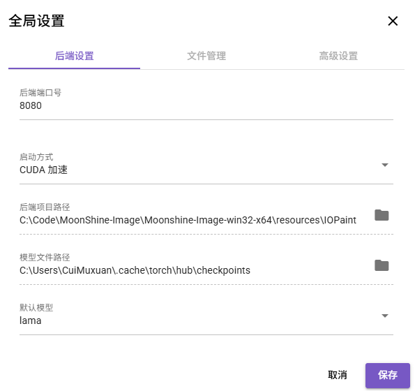

# Moonshine-Image

Moonshine 图像处理客户端

## 项目简介

这个项目是以 [IOPaint](https://github.com/Sanster/IOPaint) 为基础的二次开发项目，目前能够实现更灵活地批量为图片去除物体（或者水印、文字等）。

## 技术栈
- [Vue.js 3](https://vuejs.org/)：前端框架
- [Quasar Framework](https://quasar.dev/)：UI组件库
- [Electron](https://www.electronjs.org/)：桌面应用开发框架
- [Canvas API](https://developer.mozilla.org/zh-CN/docs/Web/API/Canvas_API)：图像处理和绘制

## 功能实现状态

- ✅ 批量图像蒙版编辑
- ✅ 批量图像处理
- ✅ 启动配置的灵活处理
- ✅ 通过前端UI启动后端程序
- 🔄 视频处理
- 📝 OCR文字识别并将蒙版提交给去除页面
- 📝 整合图片修复模型（如微软的Bringing-Old-Photos-Back-to-Life项目）
- 📝 图片文件的查看与编辑功能（裁剪、旋转、大小重置、颜色调节等）
- 📝 截图后保存或者处理功能

> 注：✅ 已实现 | 🔄 正在实现 | 📝 计划实现

目前项目没有独立的后端，后续开发过程中若有必要会建立独立的后端程序（目前可以在前端UI页面中半自动地配置后端）。
## 快速使用
方法一：获取本项目v0.0.2发行版本的zip文件并解压缩，双击 bat 一键启动脚本。
方法二：获取本项目v0.1.0及以上发行版本的zip文件并解压缩。打开exe软件后，于右上角，先调整全局配置，再点击后端管理，逐步配置环境并启动后端。

> 全局配置的后端设置仅于使用后端管理功能时有效

## 使用前准备

### 方式一：手动配置后端服务

1. 将 IOPaint 项目拉取或下载到本地：

    ```bash
    git clone https://github.com/Sanster/IOPaint.git
    ```

2. 配置后端环境：
首先要有 Python 环境，推荐 3.10 版本的环境(开发环境为3.11.5)。
安装依赖：

    ```bash
    pip install -r requirements.txt
    ```

    注意，如果需要使用 CUDA，请下载 CUDA 版本的 torch。

3. 初次启动后端项目会自动下载模型文件，若下载失败则需要手动下载 [big-lama 模型](https://huggingface.co/CuiMuxuan/big-lama/tree/main)并将其放置于 'path\to\\%当前用户名%\\.cache\torch\hub\checkpoints' 路径下。
示例：作者用户名为CuiMuxuan，模型文件放置路径为'C:\Users\CuiMuxuan\\.cache\torch\hub\checkpoints'

4. 将本项目 iopaint-change 目录下的文件替换掉 IOPaint 项目 iopaint 目录下的同名文件。

5. 在 IOPaint 目录下使用以下命令开启后端程序：
    ```bash
    python main.py start --model=lama --device=cuda --port=8080
    ```

### 方式二：使用后端管理功能配置后端服务

1. 启动具有后端功能的软件
    - 方式1：从发行版本中获取v0.1.0及以上版本的软件=>双击exe文件启动软件。
    - 方式2：git本项目和IOPaint项目=>将本项目 iopaint-change 目录下的文件替换掉 IOPaint 项目 iopaint 目录下的同名文件=>配置node环境=>以electron开发模式启动

2. 点击右上角的后端管理按钮，配置后端服务环境。

3. 根据后端管理页面的提示，开启后端服务。


> 自动配置环境的功能仅在v0.1.0及以上版本的软件中有效
> 此页面考虑到一些用户的电脑配置，可能会自动配置失败。若失败，则需要手动配置。
> 项目中存在linux系统和macOS系统适配处理的代码，但作者仅对windows系统做过测试。

环境检测步骤考虑以下几种情况：
1. 无python环境，无conda环境
    - 处理：点击'安装python按钮'，自动从python.org下载python3.11.5安装包并安装python环境。
2. 无python环境，有conda环境
    - 处理：检查是否存在名为moonshine-image的虚拟环境，若有则激活，若没有则自动创建该环境并激活。(该处理功能未测试，若正常可用或存在问题，请予我反馈)
3. 有任何可用python环境
    - 处理：显示python版本

- python环境检测完成后，检测是否存在IOPaint项目(检查路径可于全局配置中配置)
    - 处理：若不存在则显示未检测到后端项目，需要自行获取一个后端项目。

环境配置步骤
1. 检查环境中的依赖包是否存在
2. 若不存在则自动pip从镜像源下载python依赖包

服务管理步骤
1. 确认后端服务启动参数（参数初始化于全局配置中）
2. 点击‘启动服务’按钮，启动后端服务。

## 开发环境
克隆本仓库：
```bash
git clone https://github.com/CuiMuxuan/Moonshine-Image.git
```
安装依赖：
```bash
yarn
# or
npm install
```
启动开发模式（建议使用electron模式，本地文件的修改和终端的调用需要以electron模式进行）：
```bash
quasar dev
# 或启动 Electron 版本
quasar dev -m electron
```
构建
```bash
# 打包 Web 版本
quasar build
```
```bash
# 打包 Windows 桌面应用
quasar build -m electron -T win32
```
## 使用指南


以下内容为软件的使用说明
- 快速使用
    - 添加图像：点击底部工具栏中的"选择文件"按钮添加图像
    - 编辑蒙版：使用绘制工具创建或编辑图像蒙版
    - 选择处理模型：在运行设置顶部选择处理模型
    - 选择作用范围：作用范围会控制运行和下载功能生效的文件
- 批量处理
    - 方式1：选中多个文件=>作用范围选择仅选中文件
    - 方式2：作用范围选择文件夹=>设置图片文件夹、蒙版文件夹
- 进行处理
    - 点击"运行"按钮=>根据运行设置开始处理图像
    - 运行过程中可以通过后端管理页面的终端查看处理进度
- 保存结果
    - 点击"下载"按钮=>根据运行设置保存处理结果
    - 默认保存路径自动初始化全局配置中的图片路径
    - 运行设置右侧栏可以指定保存路径，其值优先级高于默认路径
- 全局配置
    - 全局配置会在前后端生效，通过全局配置可以设定后端程序的启动参数、文件的路径、前端的部分参数等:。
- 后端管理
    - 检查并配置后端服务环境，支持管理后端服务(开启、停止、设置启动参数、重启)。
## 视频演示
[点击查看视频演示](https://space.bilibili.com/589465087)
## 许可证

本项目采用 [GNU General Public License v3.0](https://www.gnu.org/licenses/gpl-3.0.html) 许可证开源。